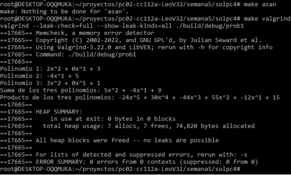
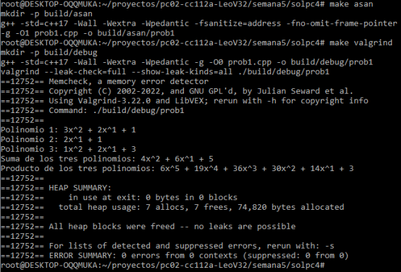
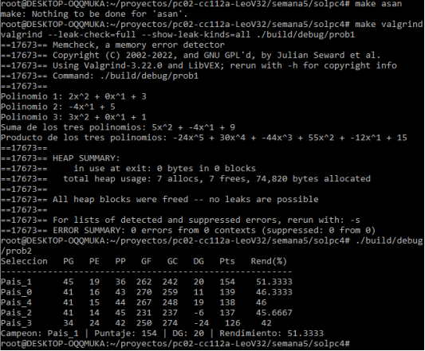
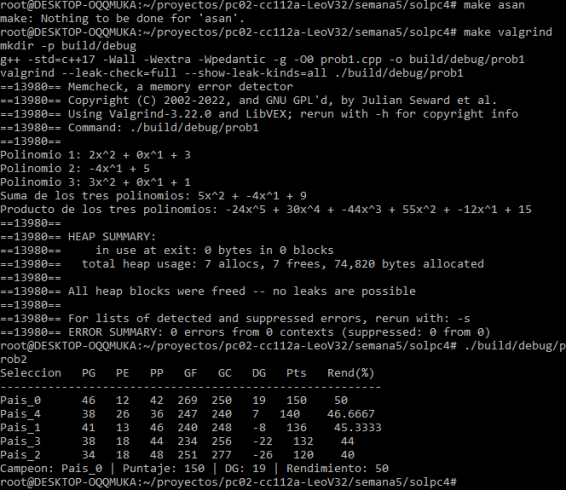
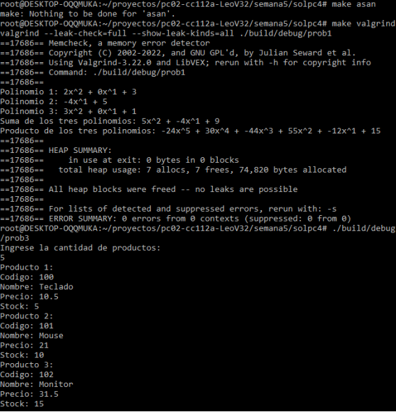
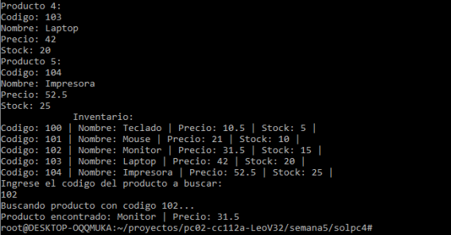
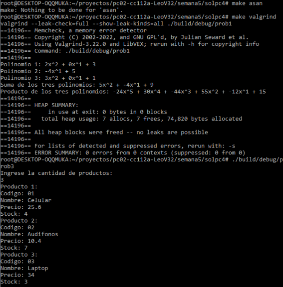
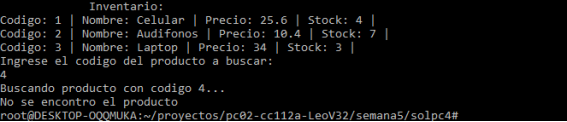

CUARTA PRÁCTICA CALIFICADA 
Curso: Fundamentos de Programación CC112 - A
Nombres y Apellidos:  Leo Alonso Velásquez Ronto
Código: 20252226H

1. 

Ejemplo 1

Ejemplo 2

2. 

Ejemplo 1

Ejemplo 2

3. 

Ejemplo 1

Ejemplo 2

